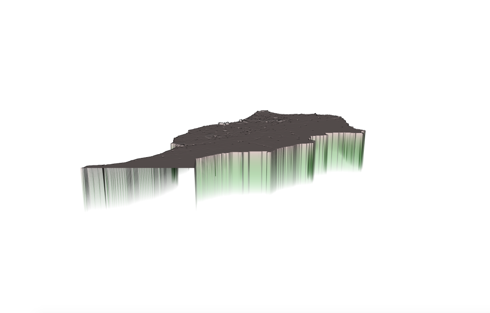
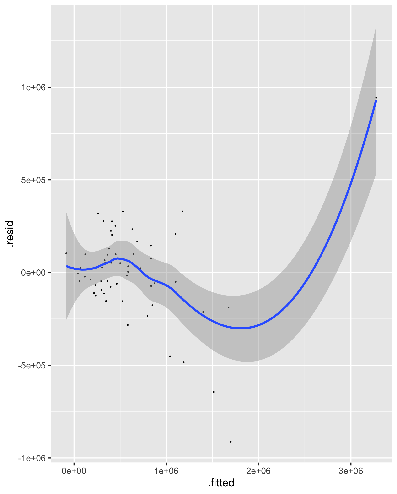
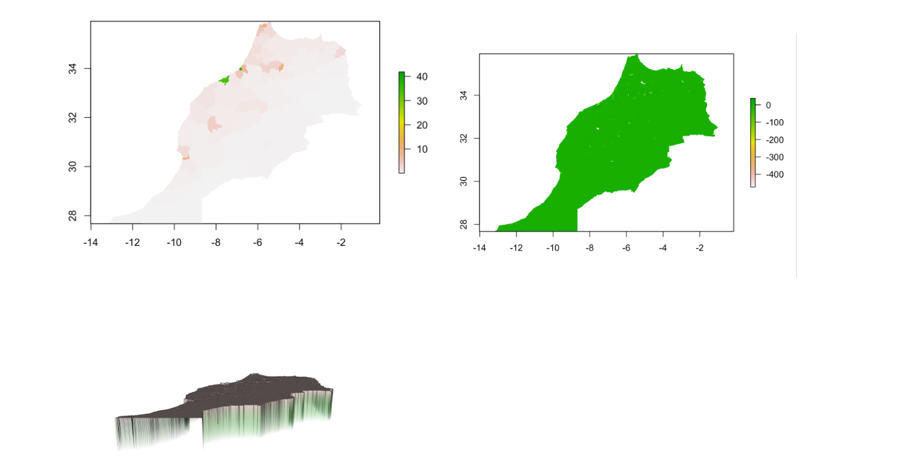
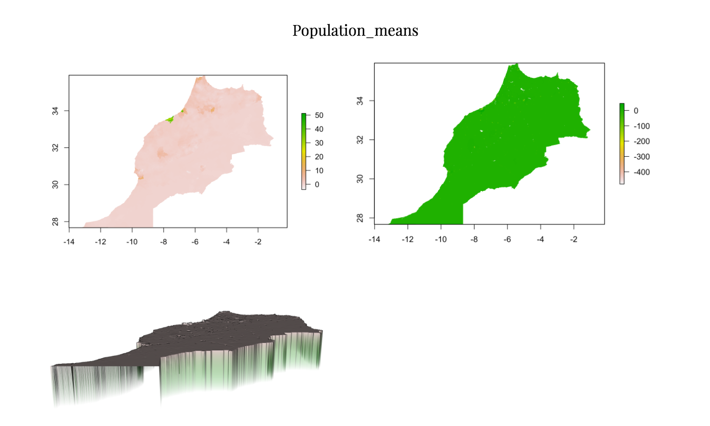
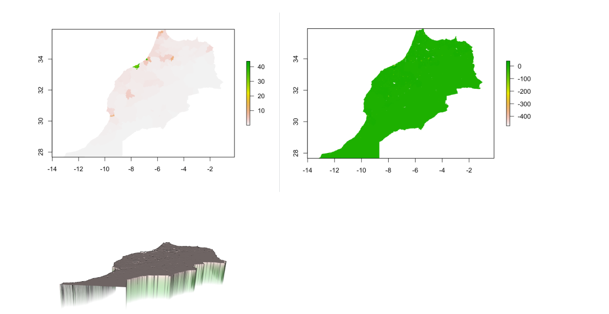

# Morocco

This is my final project on Morocco. 

# Administrative Subdivisions of Morocco 2

This plot and chart demonstrate the district (adm2) boundaries of Morocco. Names of each province, are divided into green or blue blocks, with districts subdivided within each state as demonstrated by the thin, white lines. Morocco has 75 second-level administrative subdivisions with 13 prefectures and 62 provinces. 

The population density in Morocco within its regional boundaries is also shown. The highest densities are within the Casablanca region and Marrakech - Tensift - Al-Haouz region. Such regions are the conventional cultural hub of the nation, with a stable population of around 3.36 million. It is relatively less populated in the East, where Morocco borders with Algeria. 

This plot also provides a visualized image of the population density distribution in Morocco. Regions bordering the sea are generally more populated than regions close to the land. 

Below is a 3D plot of Morocco. A higher elevation of the region indicates that the region is more highly populated. For instance, the region where Casablanca is located seems to be the highest elevated.

# Population Comparison

Below are two charts comparing Morocco's population to other factors (for instance, slope of landscape, etc.)

Sums of Population: 
Below are the three plots describing my calculated data of sums of the population of Morocco.

Means of Population: 
Below are the three plots describing my calculated data of means of the population of Morocco.

.png)

Log of Population: 
Below are the three plots describing my calculated data of Logarithm of the population of Morocco.

For Morocco, the most accurate set of data generated by R Studio is when the predictor used in the sums of all covariates and the response variable is the log of Morocco's total population. The value generated for "diff_sums" is 41555691, whereas the "diff_means" is 43859430 and "diff_logpop" is 41571985. This is because, according to results generated by the "cellStats()" function, this data set has the least differences/errors from the actual population (people per pixel raster) accurately obtained by Human Data Exchange.

Area with the most focused population is Casablanca (the green area highlighted in the difference sums plot), which makes sense considering that it is the country’s capital and reasonably acquires the most concentrated population in the area. However, it does seem that data sets for Morocco falls into the general trend to overestimate urban areas and underestimating rural areas, since the lower middle part of Morocco, according to the plots, have extremely low population. 
In addition, the difference plots for all three methods of calculation seemed to be relatively constant, and is spread out equally across the country’s landscape. This suggests consistency in accuracy of data by GADM, which supports the reliability in this analysis.

# Morocco Human Settlements, Roadways, and Healthcare Facilities

