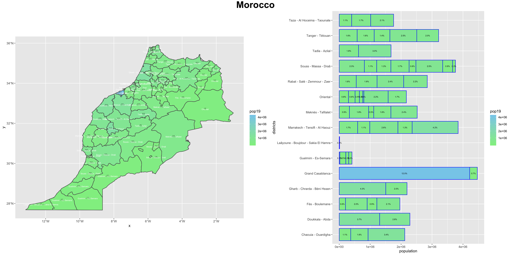

# Morocco

Greetings. My name is Anna(Siqi) Li and this is my final project on Morocco. 

# Administrative Subdivisions of Morocco 2

This plot and chart demonstrate the district (adm2) boundaries of Morocco. Names of each province, are divided into green or blue blocks, with districts subdivided within each state as demonstrated by the thin, white lines. Morocco has 75 second-level administrative subdivisions with 13 prefectures and 62 provinces. 

The population density in Morocco within its regional boundaries is also shown. The highest densities are within the Casablanca region and Marrakech - Tensift - Al-Haouz region. Such regions are the conventional cultural hub of the nation, with a stable population of around 3.36 million. It is relatively less populated in the East, where Morocco borders with Algeria. 

This plot also provides a visualized image of the population density distribution in Morocco. Regions bordering the sea are generally more populated than regions close to the land. 

Below is a 3D plot of Morocco. A higher elevation of the region indicates that the region is more highly populated. For instance, the region where Casablanca is located seems to be the highest elevated.

# Population Comparison

Below are two charts comparing Morocco's population to other factors (for instance, slope of landscape, etc.)

Sums of Population: 
Below are the three plots describing my calculated data of sums of the population of Morocco.

Means of Population: 
Below are the three plots describing my calculated data of means of the population of Morocco.

Log of Population: 
Below are the three plots describing my calculated data of Logarithm of the population of Morocco.

For Morocco, the most accurate set of data generated by R Studio is when the predictor used in the sums of all covariates and the response variable is the log of Morocco's total population. The value generated for "diff_sums" is 41555691, whereas the "diff_means" is 43859430 and "diff_logpop" is 41571985. This is because, according to results generated by the "cellStats()" function, this data set has the least differences/errors from the actual population (people per pixel raster) accurately obtained by Human Data Exchange.

Area with the most focused population is Casablanca (the green area highlighted in the difference sums plot), which makes sense considering that it is the country’s capital and reasonably acquires the most concentrated population in the area. However, it does seem that data sets for Morocco falls into the general trend to overestimate urban areas and underestimating rural areas, since the lower middle part of Morocco, according to the plots, have extremely low population. 

In addition, the difference plots for all three methods of calculation seemed to be relatively constant, and is spread out equally across the country’s landscape. This suggests consistency in accuracy of data by GADM, which supports the reliability in this analysis.

# Morocco Human Settlements, Roadways, and Healthcare Facilities

To identify the human settlements in my two selected regions in Morocco: Berkane Taourirt and Jerada, I first used the adm2 variable to verify the most densely populated areas in the two regions. As seen below.

Afterwards, I seleted the boundaries for density of urban settlements using R-studio for the two distinct regions. As shown below. 

This is the plot for urban settlements in Berkane Taourirt:

This is the plot for urban settlements in Jerada:

Hadving the two adm2 regions ready, I combined the two regions together and generated the plot below.

After downloaidng and importing GADM data files on road networks and healthcare facilities, the distinct urban settlements seem to all come together concerning the societal and environmental factors. 

Road networks: 

There are not a lot of primary roads spread out across the combined region that Iselected. However, there seemed to be too major roads across the region of BerkaneTaourirt - one going through the ocean border of Saidia and the other two going throughthe two major towns - Berkane and Tafaughalt - in the center of the province.Looking at the neighboring region of Jerada, however, we see that there are not a lot ofpresence of primary roads, whereas secondary and tertiary roads are more prevalent,indicating the region is underdeveloped. There is only one primary road that goes acrossJerada which eventually reaches a more prosperous town - it seems - that is outside ofthe Berkane & Jerada region in this case.It is most likely going to be Oujda, a bordering city in Morocco that is close to Algeria.Most clinics and hospitals I observed for this combined adm2 region, ironically it seems,are mostly based in Oujda rather than within my selected regions. 

Healthcare Facilities: 

Compared to the amount of health care facilities outside of my combined region, there isnot of them within my selected two regions to my surprise. There are a few spreadacross the tourism town of Saidia, where the beach resort is located. But there are onlytwo other health facilities located outside of Oujda within my combined region. This isquite ironic because population density is the highest in Tafoughalt, but there is onlyone health facility, whereas compared to Oujda where population density is not thathigh, but there are plenty of health care resources available.On the other hand, the province of Jerada only has one health care facility in total - nearthe bordering region with Albera - which suggests a lack of health care resources formost residents in the region.Additionally, transportation roads really do effectively link health care resourcestogether - almost all healthcare facilities are joined by one or more primary roads inBerkan Taourirt, and we can see secondary and tertiary roads expand from where thehealth care resources are as well. 

The above plot illustrates where mentioned towns and villages are. 

This is my adm2 regions combined with the topography of the region.

Topography's effect on urban areas.

Topography definitely played a huge role in the extent to which areas are urbanized in Berkane Taourirt and Jerada. It is quite striking how simply based on the altitude of hills/mountains in the region, areas are completely segregated and developed under extremely different circumstances. There are two main higher altitude hills that spread across the combined region, one separated Saidia from the wider range of Tafoughalt, Berkane, and Oujda, and the other separating Tafoughalt, Berkane, and Oujda from Jerada, which because of the hill segregation, is not densely populated. In fact, all major urban areas in my graph are areas on the lower topography in this landscape, and mostly connected with other urban areas that had the same level of altitude. 

Topography's effect on transportation networks. 

The three primary roads in the region definitely seem to be going through lower altitudes of the area - Especially the middle primary road that goes through Tafoughalt, Berkane, and Oujda, that its construction seemed to have surrounded with avoidance of uphill regions. In addition, lower areas are connected by roads to other regions of the same altitude where no hills were interfering, while secondary and tertiary roads seem to be going across hills a lot more, which indicates the lesser amount of population actually needing to utilize these minor roads across the hills, implying a lack of connectivity between regions separated by hills. 

Topography's effect on healthcare facilities.

The lack of health facilities in the center, low-altitude region (Tafoughalt, Berkane) seems to suggest that the construction and accessibility of health care facilities are largely dependent on its accessibility to the outer world. Whereas Saidia has a few health care facilities, probably due to its closeness to the outer country border, Tafoughalt and Berkane seemed to be completely segregated from medical attention. Their easiest route to access health care facilities was to travel to Oujda, where a sufficient amount of healthcare facilities are located. 

The three-dimensional map definitely assisted me in understanding the reasons behind urban distributions, roads, and healthcare facilities a lot more. Whereas while analyzing the 2D map, I only could make judgement on the results of distribution of urban settlements, now I can actually explore causes behind this particular way of urban distribution based on the landscape, which in the regions I am researching around, is significantly important. 

On the other hand, the three-dimensional map also helped me to understand why exactly is Jerada so much more isolated than other urban areas in the region. Whereas Saidia is connected to the outside and having Tafoughalt, Berkane, and Oujda locating right across the hill from Saidia, the regions’ supplies, that mainly come from the North where Saidia is located, seemed to be slowly exhausted along its distribution to Tafoughalt, Berkane, and Oujda, leaving less resources and attention to the region behind the hills. Therefore, less people choose to settle there given the geographical difficulties to travel, and also due to lack of resources. 

# Analysis of Morocco's Human Development

